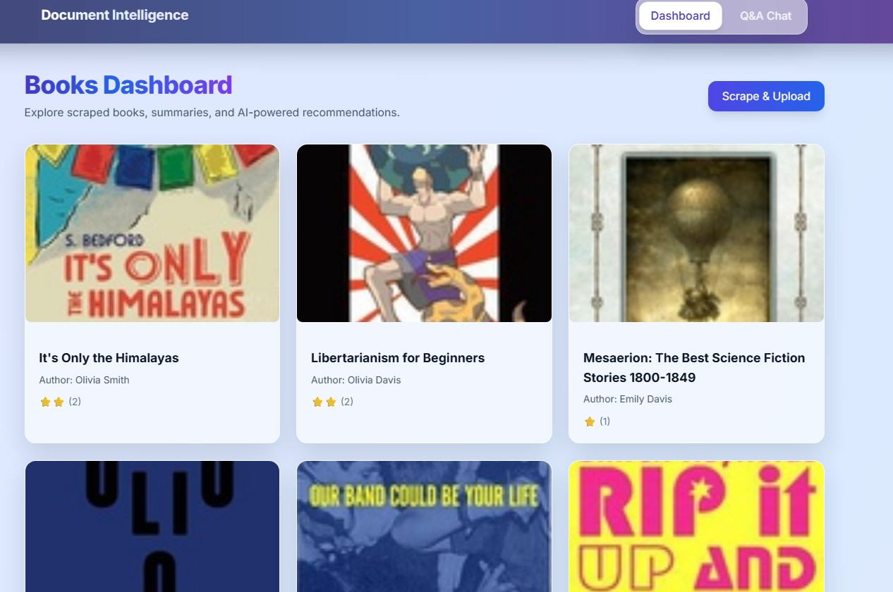
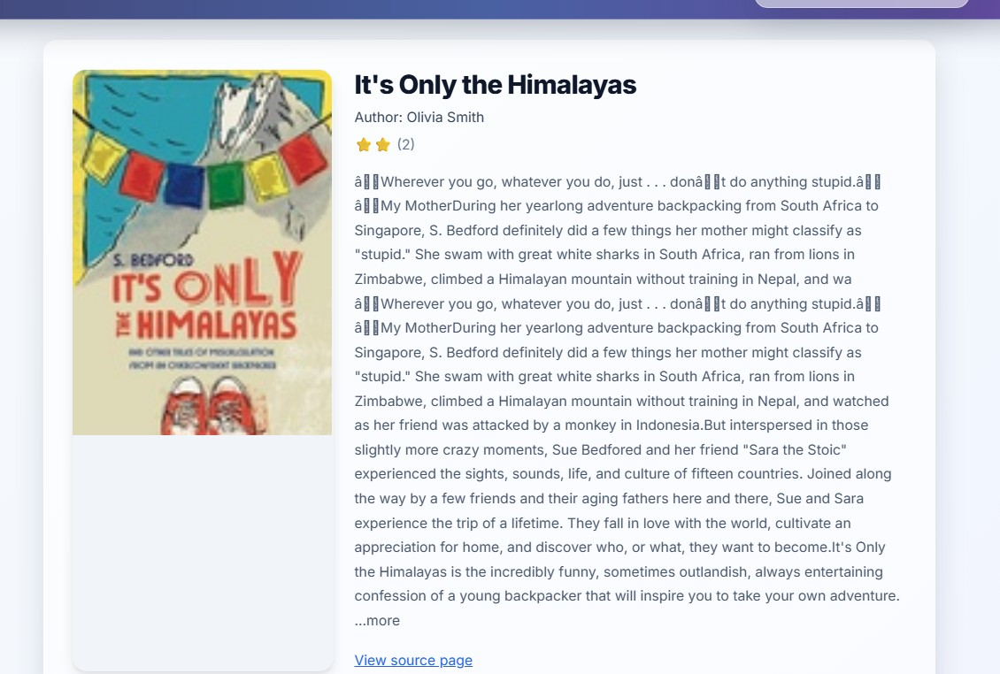
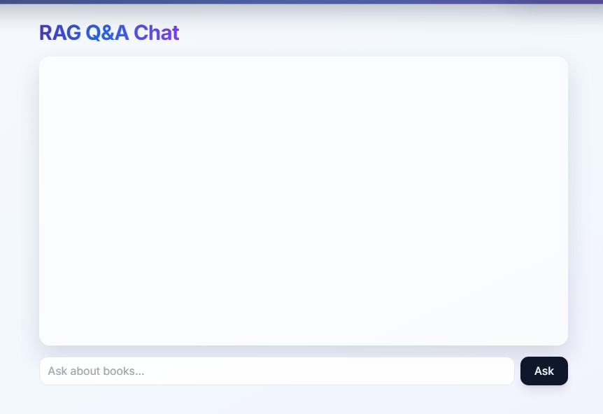

# Document Intelligence Platform

An AI-powered full-stack web application for scraping books, organizing metadata, and answering book-related questions using Retrieval-Augmented Generation (RAG).

## Overview

Document Intelligence Platform combines web scraping, natural language processing, and semantic retrieval to create an interactive book exploration experience.

The system:
- Scrapes book metadata from `books.toscrape.com`
- Stores structured data in Django models
- Generates AI summaries from descriptions
- Classifies books by genre (keyword-based)
- Supports Q&A with RAG-style book context retrieval

## Features

- Book scraping and storage
- AI-generated summary for each book
- Genre classification
- RAG-powered Q&A endpoint
- Similar book recommendations

## Tech Stack

- Backend: Django + Django REST Framework
- Frontend: React + Tailwind CSS
- Database: SQLite
- AI/NLP: Sentence Transformers + lightweight LLM pipeline
- Scraping: Requests + BeautifulSoup

## Project Structure

```text
books/
├─ backend/
│  ├─ config/
│  ├─ books/
│  ├─ manage.py
│  └─ requirements.txt
├─ frontend/
│  ├─ src/
│  ├─ package.json
│  └─ ...
└─ screenshots/
```

## Setup Instructions

### 1) Backend Setup

```bash
cd backend
python -m venv venv
```

Activate virtual environment:

- Windows (PowerShell):
```bash
venv\Scripts\Activate.ps1
```

Install dependencies:

```bash
pip install -r requirements.txt
```

Run migrations:

```bash
python manage.py migrate
```

Start backend server:

```bash
python manage.py runserver
```

Backend runs on: `http://127.0.0.1:8000`

### 2) Frontend Setup

```bash
cd frontend
npm install
npm run dev
```

Frontend runs on: `http://127.0.0.1:5173`

## API Endpoints

- `GET /books`  
  Returns all books.

- `GET /books/<id>`  
  Returns single book detail, summary, genre, and recommendations.

- `POST /books/upload`  
  Scrapes and upserts books into the database.

- `POST /ask`  
  RAG Q&A endpoint for book-related questions.

## Sample Questions for /ask

- What books are available?
- Recommend books with high ratings.
- Which books are about history?
- Give me books related to science.
- Summarize popular books in this catalog.

## Screenshots

Add UI screenshots in the `screenshots/` folder.

Recommended images:
- Dashboard page
- Book Detail page
- Q&A Chat page
- Scrape success state

Then reference them here using Markdown image links, for example:

```md
```





## Notes

- This project is prepared for GitHub submission with clear setup and endpoint documentation.
- Keep `.env` and local secrets out of version control.
